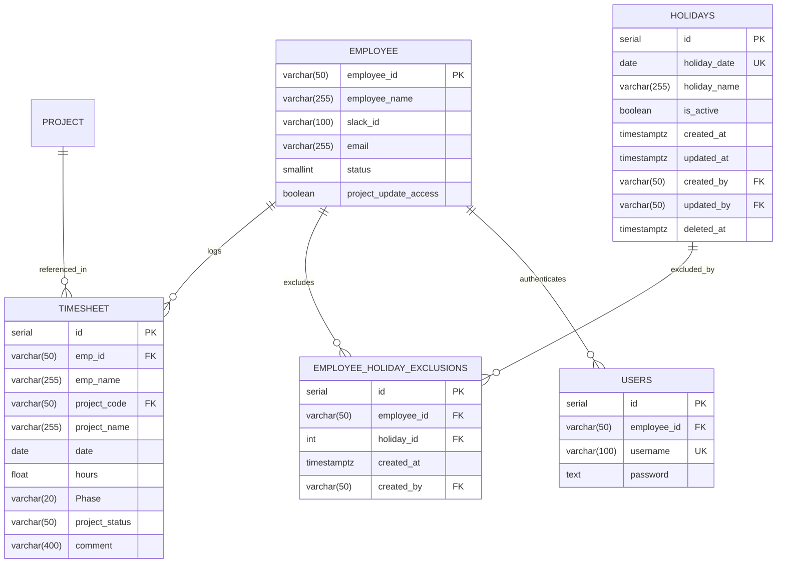
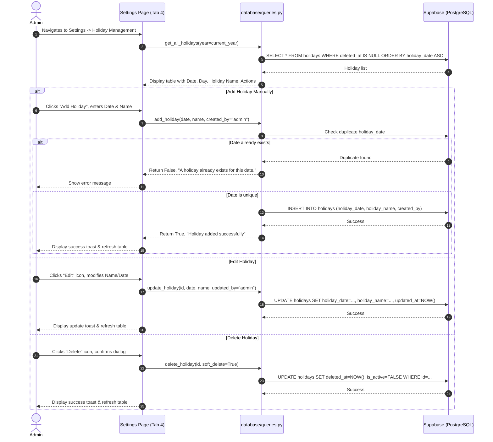
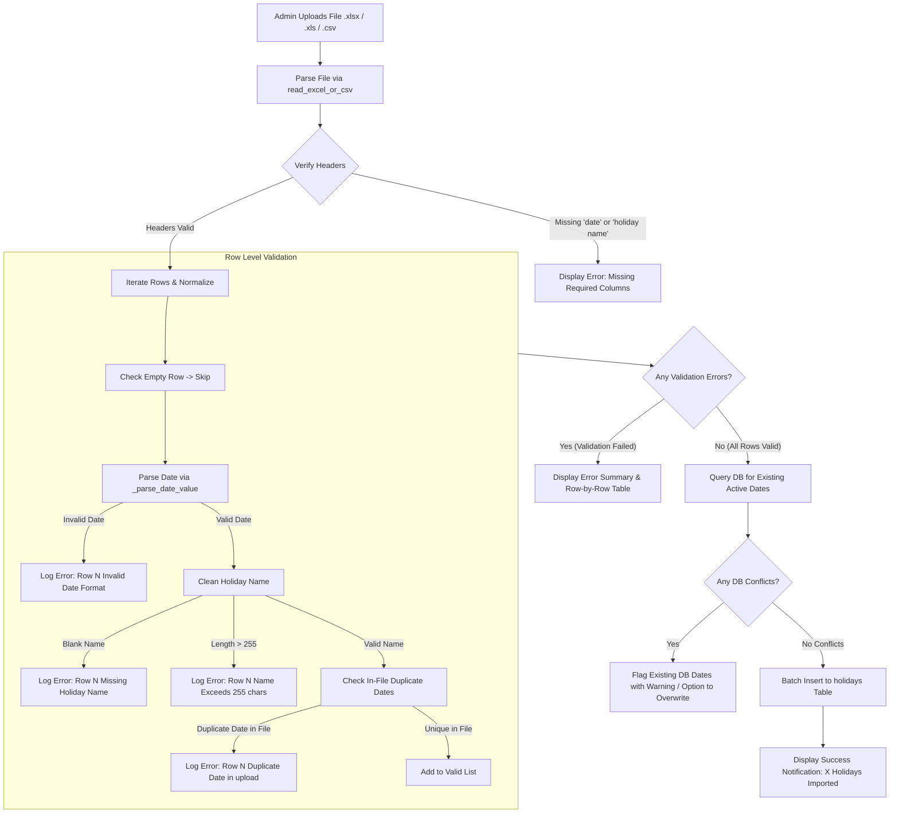
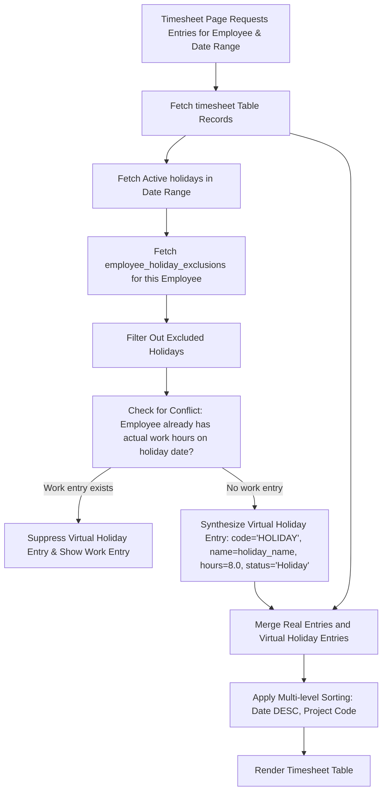
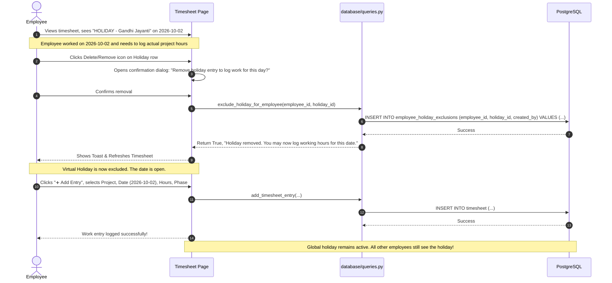
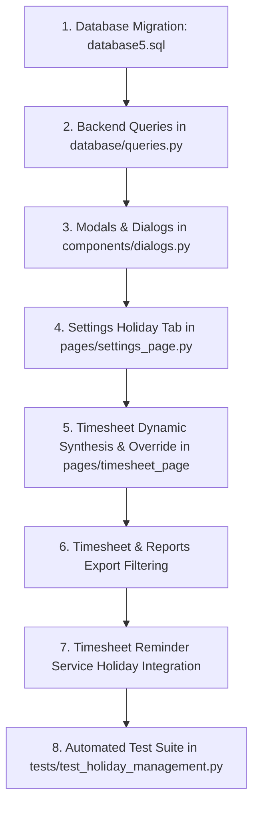

# Technical Implementation Plan: Holiday Management Feature

**Author:** DeepMind Agentic Coding Team  
**Target Application:** Timesheet App (Version 3)  
**Document Version:** 1.0.0  
**Target File:** `holiday-management-implementation-plan.md`  
**Date:** 2026-09-16  

---

## 1. Feature Overview

The **Holiday Management** feature introduces administrative configuration and timesheet automation for organization-wide holidays. The goal is to provide a single source of truth for public, national, and company-designated holidays, automatically reflect them in employee timesheets, permit employees who work on a holiday to override/remove the holiday entry from their timesheet, and guarantee that holiday entries are excluded from billable timesheet exports.

### Core Objectives
1. **Administrative Control (`Settings → Holiday`)**: Administrators configure holidays either manually through a modal form or via batch import using standard Excel/CSV templates (`date, holiday name`).
2. **Universal Application**: A configured holiday automatically applies to all active employees on the selected calendar date.
3. **Timesheet Integration**: Holidays appear on the timesheet with distinct visual hierarchy, identified as `HOLIDAY` entries (non-billable out-of-office logs).
4. **Employee Self-Service Override**: If an employee works on a configured holiday, they can remove the holiday entry from their personal timesheet without altering the global holiday configuration or affecting any other employee. Once removed, the employee can log regular project hours.
5. **Strict Export Exclusion**: Holiday entries are strictly excluded from Excel/CSV timesheet exports (matching the existing convention for leave entries).
6. **Timezone-Safe Calendar Date Handling**: Holiday dates represent calendar dates (`YYYY-MM-DD`) without UTC conversion shifts.

---

## 2. Current Codebase Analysis

An inspection of the existing codebase reveals the following architectural patterns and implementation points:

### 2.1 Technology Stack
* **Frontend/Application Framework:** Streamlit (`v1.57.0`) with custom CSS injections (`assets/css/style.css`), Streamlit dialogs (`@st.dialog`), and Streamlit tabs (`st.tabs`).
* **Database & Data Access:** PostgreSQL hosted on Supabase, accessed primarily through the `supabase-py` SDK (`get_supabase_client()` in `database/connection.py`). Direct SQL queries are deprecated.
* **Data Processing & Export:** `pandas` and `openpyxl` via a dedicated utility `utils/xlsx_export.py` (`build_clean_xlsx`).
* **Background Tasks & Scheduler:** `APScheduler` (`services/scheduler_service.py` and `services/timesheet_reminder_service.py`).
* **Security & Authentication:** Role-based session state (`user["role"]` in `["admin", "employee"]`), username/password authentication with blowfish/bcrypt encryption (`services/auth_service.py`).

### 2.2 Existing Settings Module (`pages/settings_page.py`)
* Renders under `render_settings_page()`.
* Organizes sub-modules using `st.tabs([ ... ])`:
  1. `🗓️ Weekly Lockout Schedule` (manages `lockout_settings.json` via `utils/lockout_helpers.py`)
  2. `👥 Employee Permissions` (manages `project_update_access` on `employee` table)
  3. `📧 Timesheet Reminder Settings` (manages automated email reminders via `app_settings` and `timesheet_reminder_logs`)
* **Access Control:** The Settings page is only linked in `components/sidebar.py` when `user["role"] == "admin"`.

### 2.3 Existing Timesheet Module (`pages/timesheet_page/__init__.py`)
* Fetches timesheet entries via `get_timesheets(start_date, end_date, emp_id, project_code)` in `database/queries.py`.
* Timesheet rows are rendered via custom flexbox HTML cards with inline column sorting and action buttons (Edit, Delete, Duplicate).
* **Leave Entry Pattern:** Leave entries are stored directly in `timesheet` with `project_code` starting with `LEAVE-` (`LEAVE-CL`, `LEAVE-SL`, `LEAVE-PL`, `LEAVE-UL`, `LEAVE-OTHER`).
  * Rendered with amber styling (`#fffbeb`, `#f59e0b`), labeled `LEAVE LOG`, and marked `🚫 Excluded from export`.
  * Regular entries check `has_leave_for_date(emp_id, date)` to block work hour logging on approved leave dates.
* **Export Pattern:** In `pages/timesheet_page/__init__.py` (line 263):
  ```python
  export_df = data[~data['project_code'].str.startswith('LEAVE-', na=False)].copy()
  ```
  Exports are sanitized and rendered into XLSX using `build_clean_xlsx(output_df, sheet_name='Timesheets')`.

### 2.4 Existing Import Module (`pages/import_page.py` & `database/queries.py`)
* Supports `.xlsx`, `.xls`, and `.csv` uploads via `read_excel_or_csv()`.
* Standard date parsing helper `_parse_date_value(val)` in `database/queries.py` handles:
  * Excel serial numbers (10000–99999) using `pd.to_datetime(f_val, unit='D', origin='1899-12-30')`.
  * Python `datetime.date` and `Timestamp` objects.
  * Mixed string formats (`YYYY-MM-DD`, `DD-MM-YYYY`, `DD/MM/YYYY`).
* Existing imports (`import_employees`, `import_projects`, `import_assignments`) validate headers case-insensitively, sanitize inputs, validate batch uniqueness, and perform atomic or batch upserts via Supabase SDK.

### 2.5 Timesheet Reminder Service (`services/timesheet_reminder_service.py`)
* Calculates working days (Mon–Fri) using `get_applicable_days(reference_date)`.
* Compares working days against `get_timesheet_dates_for_employee(emp_id, start_date, end_date)`.
* Currently, non-holiday weekdays with no timesheet entries trigger warning emails. Integrating holidays will prevent false reminder emails on holidays.

---

## 3. Architecture & Design Trade-Offs

### 3.1 Timesheet Holiday Integration: Dynamic vs. Persisted

A critical architectural decision is how holidays interface with employee timesheets.

| Dimension | Option A: Persisted Timesheet Rows | Option B: Dynamic Synthesis (Recommended) |
| :--- | :--- | :--- |
| **Mechanism** | Inserting physical rows into the `timesheet` table for every employee when a holiday is created. | Querying the `holidays` master table dynamically and merging non-excluded holidays into timesheet views. |
| **Storage & Scaling** | Generates $N \times M$ rows (e.g., 100 employees $\times$ 15 holidays = 1,500 rows/year). Table bloat. | Generates only $M$ master holiday rows plus sparse exclusion records when employees override. |
| **New Employee Onboarding** | Requires batch backfill or onboarding scripts to populate future holidays for new hires. | Zero backfill needed. A newly created employee immediately sees all configured holidays. |
| **Admin Modifications** | Changing a holiday date/name requires bulk updating or deleting/re-inserting hundreds of rows across `timesheet`. | Updating one row in `holidays` instantly updates timesheets for all employees. |
| **Employee Override** | Deletes the employee's specific row in `timesheet`. Hard to distinguish an admin deletion from an employee working on a holiday. | Inserts a single record into `employee_holiday_exclusions`. The global holiday remains completely untouched. |
| **Audit & Integrity** | High risk of orphaned records, sync bugs, and race conditions during bulk operations. | Pristine separation of concerns: Master config vs. Employee override. |

### Architectural Decision
**Option B (Dynamic Synthesis with Exclusion Table) is selected.**
* Master holidays are stored once in `holidays`.
* When fetching timesheets for an employee, non-excluded holidays within the date range are dynamically synthesized as virtual timesheet entries with `project_code = 'HOLIDAY'`.
* When an employee works on a holiday and clicks **Remove / Delete**, a record is inserted into `employee_holiday_exclusions`.
* When an admin deletes a holiday from Settings, historical timesheets remain protected via soft deletion (`deleted_at` timestamp).

---

## 4. Database Schema Changes

Two new tables are required: `holidays` and `employee_holiday_exclusions`.

### 4.1 Table: `holidays`
Stores organization-wide configured holidays.

```sql
CREATE TABLE IF NOT EXISTS holidays (
    id SERIAL PRIMARY KEY,
    holiday_date DATE NOT NULL,
    holiday_name VARCHAR(255) NOT NULL,
    is_active BOOLEAN NOT NULL DEFAULT TRUE,
    created_at TIMESTAMP WITH TIME ZONE NOT NULL DEFAULT NOW(),
    updated_at TIMESTAMP WITH TIME ZONE NOT NULL DEFAULT NOW(),
    created_by VARCHAR(50) REFERENCES employee(employee_id) ON DELETE SET NULL,
    updated_by VARCHAR(50) REFERENCES employee(employee_id) ON DELETE SET NULL,
    deleted_at TIMESTAMP WITH TIME ZONE NULL
);

-- Unique constraint ensuring only one active holiday exists per date
CREATE UNIQUE INDEX IF NOT EXISTS uq_holidays_active_date 
ON holidays (holiday_date) 
WHERE deleted_at IS NULL;

-- Index for date range searches
CREATE INDEX IF NOT EXISTS idx_holidays_date 
ON holidays (holiday_date);

-- Trigger for updated_at
CREATE OR REPLACE FUNCTION update_holidays_timestamp()
RETURNS TRIGGER AS $$
BEGIN
    NEW.updated_at = NOW();
    RETURN NEW;
END;
$$ LANGUAGE plpgsql;

DROP TRIGGER IF EXISTS trigger_holidays_updated_at ON holidays;
CREATE TRIGGER trigger_holidays_updated_at
BEFORE UPDATE ON holidays
FOR EACH ROW
EXECUTE FUNCTION update_holidays_timestamp();
```

#### Field Specifications: `holidays`
| Column Name | Data Type | Nullable | Default | Description |
| :--- | :--- | :--- | :--- | :--- |
| `id` | `SERIAL` | No | Auto-increment | Primary Key |
| `holiday_date` | `DATE` | No | None | Calendar date (`YYYY-MM-DD`) of the holiday |
| `holiday_name` | `VARCHAR(255)` | No | None | Name/title of the holiday (e.g., "Gandhi Jayanti") |
| `is_active` | `BOOLEAN` | No | `TRUE` | Soft-deletion flag |
| `created_at` | `TIMESTAMPTZ` | No | `NOW()` | Audit timestamp of creation |
| `updated_at` | `TIMESTAMPTZ` | No | `NOW()` | Audit timestamp of last update |
| `created_by` | `VARCHAR(50)` | Yes | `NULL` | Employee ID of admin who configured the holiday |
| `updated_by` | `VARCHAR(50)` | Yes | `NULL` | Employee ID of admin who updated the holiday |
| `deleted_at` | `TIMESTAMPTZ` | Yes | `NULL` | Soft deletion timestamp |

---

### 4.2 Table: `employee_holiday_exclusions`
Maintains individual employee exclusions when an employee works on a configured holiday and removes it from their timesheet.

```sql
CREATE TABLE IF NOT EXISTS employee_holiday_exclusions (
    id SERIAL PRIMARY KEY,
    employee_id VARCHAR(50) NOT NULL REFERENCES employee(employee_id) ON DELETE CASCADE,
    holiday_id INT NOT NULL REFERENCES holidays(id) ON DELETE CASCADE,
    created_at TIMESTAMP WITH TIME ZONE NOT NULL DEFAULT NOW(),
    created_by VARCHAR(50) REFERENCES employee(employee_id) ON DELETE SET NULL
);

-- Ensure an employee cannot have duplicate exclusion records for the same holiday
CREATE UNIQUE INDEX IF NOT EXISTS uq_emp_holiday_exclusion 
ON employee_holiday_exclusions (employee_id, holiday_id);

-- Performance index for fast joining/filtering during timesheet fetch
CREATE INDEX IF NOT EXISTS idx_exclusions_emp_holiday 
ON employee_holiday_exclusions (employee_id, holiday_id);
```

#### Field Specifications: `employee_holiday_exclusions`
| Column Name | Data Type | Nullable | Default | Description |
| :--- | :--- | :--- | :--- | :--- |
| `id` | `SERIAL` | No | Auto-increment | Primary Key |
| `employee_id` | `VARCHAR(50)` | No | None | FK to `employee.employee_id`. On delete cascade. |
| `holiday_id` | `INT` | No | None | FK to `holidays.id`. On delete cascade. |
| `created_at` | `TIMESTAMPTZ` | No | `NOW()` | Audit timestamp when the employee removed the holiday |
| `created_by` | `VARCHAR(50)` | Yes | `NULL` | Employee ID who initiated the exclusion |

---

## 5. ER & Data Relationship Model

### 5.1 Mermaid Entity-Relationship Diagram



---

## 6. Detailed System Flows

### 6.1 Settings → Holiday Administrative Flow



---

### 6.2 Holiday Import Flow



---

### 6.3 Timesheet Fetch & Dynamic Holiday Merging Flow



---

### 6.4 Employee Working on Holiday (Exclusion Flow)



---

## 7. Backend & Data Layer Changes (`database/queries.py`)

The following functions must be added or modified in `database/queries.py`:

### 7.1 New Holiday Management Queries

```python
def get_all_holidays(year=None, include_inactive=False):
    """
    Fetch configured holidays.
    If year is specified, filters holidays for that calendar year.
    Ordered by holiday_date ascending.
    """
    supabase = get_supabase_client()
    if not supabase: return pd.DataFrame(columns=['id', 'holiday_date', 'holiday_name', 'created_at', 'created_by'])
    
    query = supabase.table('holidays').select('id, holiday_date, holiday_name, is_active, created_at, created_by, deleted_at')
    if not include_inactive:
        query = query.is_('deleted_at', 'null')
    if year:
        query = query.gte('holiday_date', f"{year}-01-01").lte('holiday_date', f"{year}-12-31")
        
    res = query.order('holiday_date', desc=False).execute()
    data = res.data or []
    return pd.DataFrame(data)

def add_holiday(holiday_date, holiday_name, created_by='admin'):
    """
    Add a new holiday. Enforces date uniqueness for active holidays.
    holiday_date: datetime.date or ISO string 'YYYY-MM-DD'.
    """
    supabase = get_supabase_client()
    if not supabase: return False, "Configuration error"
    
    date_str = holiday_date.isoformat() if hasattr(holiday_date, 'isoformat') else str(holiday_date).strip()
    name_str = str(holiday_name).strip()
    
    if not date_str:
        return False, "Holiday date is required."
    if not name_str:
        return False, "Holiday name is required."
    if len(name_str) > 255:
        return False, "Holiday name cannot exceed 255 characters."
        
    try:
        # Check active duplicate
        res = supabase.table('holidays').select('id, holiday_name').eq('holiday_date', date_str).is_('deleted_at', 'null').execute()
        if res.data:
            existing = res.data[0]
            return False, f"A holiday ('{existing['holiday_name']}') already exists on {date_str}."
            
        data = {
            "holiday_date": date_str,
            "holiday_name": name_str,
            "is_active": True,
            "created_by": created_by
        }
        supabase.table('holidays').insert(data).execute()
        return True, "Holiday added successfully."
    except Exception as e:
        return False, str(e)

def update_holiday(holiday_id, holiday_date, holiday_name, updated_by='admin'):
    """
    Update an existing holiday date and name.
    """
    supabase = get_supabase_client()
    if not supabase: return False, "Configuration error"
    
    date_str = holiday_date.isoformat() if hasattr(holiday_date, 'isoformat') else str(holiday_date).strip()
    name_str = str(holiday_name).strip()
    
    if not date_str: return False, "Holiday date is required."
    if not name_str: return False, "Holiday name is required."
    if len(name_str) > 255: return False, "Holiday name cannot exceed 255 characters."
    
    try:
        # Check duplicate date conflict with other records
        res = supabase.table('holidays').select('id').eq('holiday_date', date_str).neq('id', holiday_id).is_('deleted_at', 'null').execute()
        if res.data:
            return False, f"Another holiday already exists on {date_str}."
            
        data = {
            "holiday_date": date_str,
            "holiday_name": name_str,
            "updated_by": updated_by
        }
        supabase.table('holidays').update(data).eq('id', holiday_id).execute()
        return True, "Holiday updated successfully."
    except Exception as e:
        return False, str(e)

def delete_holiday(holiday_id, soft_delete=True, updated_by='admin'):
    """
    Delete a holiday. Defaults to soft deletion to preserve historical timesheet integrity.
    """
    supabase = get_supabase_client()
    if not supabase: return False, "Configuration error"
    
    try:
        if soft_delete:
            import datetime
            now_iso = datetime.datetime.now(datetime.timezone.utc).isoformat()
            supabase.table('holidays').update({
                'is_active': False,
                'deleted_at': now_iso,
                'updated_by': updated_by
            }).eq('id', holiday_id).execute()
        else:
            supabase.table('holidays').delete().eq('id', holiday_id).execute()
        return True, "Holiday deleted successfully."
    except Exception as e:
        return False, str(e)
```

### 7.2 Holiday Batch Import Function

```python
def import_holidays(df, created_by='admin'):
    """
    Import holidays from a DataFrame containing ['date', 'holiday name'].
    Returns: (success: bool, message: str, details: dict)
    """
    supabase = get_supabase_client()
    if not supabase: return False, "Configuration error", {}
    
    # 1. Normalize columns
    col_map = {str(c).strip().lower(): c for c in df.columns}
    required = ['date', 'holiday name']
    for r in required:
        if r not in col_map:
            return False, f"Missing required column: '{r}'. File must contain columns 'date' and 'holiday name'.", {}
            
    valid_records = []
    seen_dates = set()
    errors = []
    
    # 2. Row by row validation
    for idx, row in df.iterrows():
        row_num = idx + 2 # Header is row 1
        raw_date = row[col_map['date']]
        raw_name = row[col_map['holiday name']]
        
        # Check empty row
        if (pd.isna(raw_date) or str(raw_date).strip() == "") and (pd.isna(raw_name) or str(raw_name).strip() == ""):
            continue
            
        # Validate date
        parsed_date = _parse_date_value(raw_date)
        if not parsed_date:
            errors.append(f"Row {row_num}: Invalid or missing date '{raw_date}'.")
            continue
            
        # Validate name
        name_str = str(raw_name).strip() if pd.notna(raw_name) else ""
        if not name_str:
            errors.append(f"Row {row_num}: Missing holiday name.")
            continue
        if len(name_str) > 255:
            errors.append(f"Row {row_num}: Holiday name exceeds 255 characters.")
            continue
            
        # Check duplicate date within file
        if parsed_date in seen_dates:
            errors.append(f"Row {row_num}: Duplicate date '{parsed_date}' found within uploaded file.")
            continue
        seen_dates.add(parsed_date)
        
        valid_records.append({
            "holiday_date": parsed_date,
            "holiday_name": name_str,
            "is_active": True,
            "created_by": created_by
        })
        
    if errors:
        return False, f"Validation failed with {len(errors)} error(s).", {"errors": errors, "valid_count": len(valid_records)}
        
    if not valid_records:
        return False, "No valid holiday records found in file.", {}
        
    # 3. Check for existing dates in DB
    dates_to_check = [r['holiday_date'] for r in valid_records]
    existing_res = supabase.table('holidays').select('holiday_date, holiday_name').in_('holiday_date', dates_to_check).is_('deleted_at', 'null').execute()
    if existing_res.data:
        db_conflicts = [f"{r['holiday_date']} ({r['holiday_name']})" for r in existing_res.data]
        return False, f"Import rejected: {len(db_conflicts)} date(s) already exist in system: {', '.join(db_conflicts[:5])}{'...' if len(db_conflicts) > 5 else ''}", {"conflicts": db_conflicts}
        
    # 4. Batch insert
    try:
        supabase.table('holidays').insert(valid_records).execute()
        return True, f"Successfully imported {len(valid_records)} holidays.", {"imported_count": len(valid_records)}
    except Exception as e:
        return False, f"Database error during import: {str(e)}", {}
```

### 7.3 Employee Holiday Exclusion Queries

```python
def get_employee_holiday_exclusions(emp_id, start_date=None, end_date=None):
    """
    Get set of holiday_ids or dates excluded by the given employee.
    """
    supabase = get_supabase_client()
    if not supabase or not emp_id: return set()
    
    try:
        res = supabase.table('employee_holiday_exclusions').select('holiday_id').eq('employee_id', emp_id).execute()
        return {r['holiday_id'] for r in (res.data or [])}
    except Exception:
        return set()

def exclude_holiday_for_employee(emp_id, holiday_id, created_by=None):
    """
    Record that an employee worked on a holiday and excluded it from their timesheet.
    """
    supabase = get_supabase_client()
    if not supabase: return False, "Configuration error"
    
    try:
        supabase.table('employee_holiday_exclusions').upsert({
            "employee_id": emp_id,
            "holiday_id": holiday_id,
            "created_by": created_by or emp_id
        }, on_conflict='employee_id, holiday_id').execute()
        return True, "Holiday entry removed. You may now record your work hours for this date."
    except Exception as e:
        return False, str(e)

def has_active_holiday_for_date(emp_id, date):
    """
    Check if a calendar date has an active holiday for this employee (i.e. Not excluded).
    Used to prompt employee to remove the holiday first before adding regular work hours.
    """
    supabase = get_supabase_client()
    if not supabase: return False, None
    date_str = date.isoformat() if hasattr(date, 'isoformat') else str(date)
    
    try:
        # 1. Fetch active holiday for date
        res = supabase.table('holidays').select('id, holiday_name').eq('holiday_date', date_str).is_('deleted_at', 'null').execute()
        if not res.data:
            return False, None
        holiday = res.data[0]
        
        # 2. Check if employee has excluded it
        if emp_id:
            ex_res = supabase.table('employee_holiday_exclusions').select('id').eq('employee_id', emp_id).eq('holiday_id', holiday['id']).execute()
            if ex_res.data:
                return False, None # Excluded
                
        return True, holiday
    except Exception:
        return False, None
```

### 7.4 Modification to `get_timesheets()`

Update `get_timesheets` in `database/queries.py` to seamlessly synthesize holiday entries:

```python
def get_timesheets(start_date=None, end_date=None, emp_id=None, project_code=None, include_holidays=True):
    """
    Fetch timesheet entries with optional filters, dynamically merging configured holidays.
    """
    supabase = get_supabase_client()
    if not supabase: return pd.DataFrame()
    
    query = supabase.table('timesheet').select('id, emp_id, emp_name, project_code, project_name, date, hours, Phase, project_status, comment')
    if start_date: query = query.gte('date', start_date.isoformat() if hasattr(start_date, 'isoformat') else start_date)
    if end_date: query = query.lte('date', end_date.isoformat() if hasattr(end_date, 'isoformat') else end_date)
    if emp_id: query = query.eq('emp_id', emp_id)
    if project_code: query = query.eq('project_code', project_code)
    
    res = query.order('date', desc=True).execute()
    data = res.data or []
    
    cols = ['id', 'emp_id', 'emp_name', 'project_code', 'project_name', 'date', 'hours', 'Phase', 'project_status', 'comment']
    rows = []
    
    logged_dates_by_emp = {}
    for r in data:
        eid = r['emp_id']
        d_val = r['date']
        if eid not in logged_dates_by_emp: logged_dates_by_emp[eid] = set()
        logged_dates_by_emp[eid].add(d_val)
        
        rows.append([
            r['id'],
            r['emp_id'],
            r['emp_name'],
            r['project_code'],
            decrypt_data(r['project_name']),
            r['date'],
            r['hours'],
            r['Phase'],
            r['project_status'],
            r.get('comment', '')
        ])
    
    # Dynamically inject holidays if project_code is None or 'HOLIDAY'
    if include_holidays and (project_code is None or str(project_code).startswith('HOLIDAY')):
        try:
            h_query = supabase.table('holidays').select('id, holiday_date, holiday_name').is_('deleted_at', 'null')
            if start_date: h_query = h_query.gte('holiday_date', start_date.isoformat() if hasattr(start_date, 'isoformat') else start_date)
            if end_date: h_query = h_query.lte('holiday_date', end_date.isoformat() if hasattr(end_date, 'isoformat') else end_date)
            h_res = h_query.execute()
            holidays = h_res.data or []
            
            if holidays:
                # Determine which employees to synthesize holidays for
                if emp_id:
                    emp_list = [{'employee_id': emp_id, 'employee_name': get_employee_name_by_id(emp_id)}]
                else:
                    # All active employees
                    emp_res = supabase.table('employee').select('employee_id, employee_name').eq('status', 1).execute()
                    emp_list = emp_res.data or []
                    
                # Fetch all exclusions in this range
                holiday_ids = [h['id'] for h in holidays]
                ex_res = supabase.table('employee_holiday_exclusions').select('employee_id, holiday_id').in_('holiday_id', holiday_ids).execute()
                exclusions_set = {(r['employee_id'], r['holiday_id']) for r in (ex_res.data or [])}
                
                for h in holidays:
                    h_id = h['id']
                    h_date = h['holiday_date']
                    h_name = h['holiday_name']
                    
                    for emp in emp_list:
                        e_id = emp['employee_id']
                        if e_id == 'admin': continue # Admin does not log timesheets
                        
                        # If employee excluded this holiday, skip
                        if (e_id, h_id) in exclusions_set:
                            continue
                            
                        # If employee already has an actual work entry logged on this date, skip
                        if e_id in logged_dates_by_emp and h_date in logged_dates_by_emp[e_id]:
                            continue
                            
                        # Synthesize virtual holiday row
                        rows.append([
                            f"HOLIDAY-{h_id}-{e_id}", # Virtual deterministic ID
                            e_id,
                            emp['employee_name'],
                            f"HOLIDAY-{h_id}",
                            h_name,
                            h_date,
                            8.0, # Standard day duration
                            "Holiday",
                            "Holiday",
                            "Public Holiday"
                        ])
        except Exception as ex:
            print(f"Error synthesizing holiday entries: {ex}")
            
    df = pd.DataFrame(rows, columns=cols)
    return df
```

### 7.5 Modification to `add_timesheet_entry()` and `update_timesheet_entry()`

Ensure work entries cannot conflict with an un-excluded holiday:

```python
# In add_timesheet_entry:
is_holiday, holiday_info = has_active_holiday_for_date(emp_id, date_str)
if is_holiday:
    return False, f"This date is marked as '{holiday_info['holiday_name']}'. If you worked on this day, please remove the holiday entry from your timesheet first."
```

### 7.6 Modification to `services/timesheet_reminder_service.py`

Update `get_applicable_days(reference_date)` to exclude configured holidays so employees are not falsely notified on holidays:

```python
def get_applicable_days(reference_date=None):
    """Return working-day dates (Mon–Fri) excluding active organization holidays."""
    if reference_date is None:
        reference_date = datetime.date.today()
    monday, friday = get_current_week_range(reference_date)
    
    # Query holidays in this week
    from database.queries import get_all_holidays
    h_df = get_all_holidays(year=reference_date.year)
    holiday_dates = set()
    if not h_df.empty:
        holiday_dates = set(pd.to_datetime(h_df['holiday_date']).dt.date)
        
    days = []
    for i in range(5):  # Mon=0 … Fri=4
        day = monday + datetime.timedelta(days=i)
        if day not in holiday_dates:
            days.append(day)
    return days
```

---

## 8. Frontend Changes

### 8.1 Settings Page (`pages/settings_page.py`)
Add a new 4th tab: `"🏖️ Holiday"` to `st.tabs`:

```python
tab1, tab2, tab3, tab4 = st.tabs([
    "🗓️ Weekly Lockout Schedule", 
    "👥 Employee Permissions", 
    "📧 Timesheet Reminder Settings",
    "🏖️ Holiday Management"
])
```

#### Tab 4 Content Structure:
1. **Header & Action Toolbar:**
   * Title: `### 🏖️ Holiday Management`
   * Caption: `Configure company-wide holidays applicable to all employees. Add manually or import via Excel/CSV.`
   * Top bar with 3 columns:
     * Column 1: Year Filter Selectbox (`All`, `2025`, `2026`, `2027`, default: current year).
     * Column 2: `➕ Add Holiday` button (opens `add_holiday_dialog()`).
     * Column 3: `📥 Import Holidays` button (opens `import_holiday_dialog()`).
2. **Holiday Listing Table:**
   * Uses Streamlit container with styled HTML cards (matching existing app design).
   * Columns displayed:
     * **Date:** `DD-MM-YYYY` (bold) + Day of week (e.g. `Friday`).
     * **Holiday Name:** e.g. `Gandhi Jayanti`.
     * **Audit Info:** Created by (`@username`) and created date.
     * **Actions:**
       * `✏️ Edit` button (opens `edit_holiday_dialog(holiday_data)`).
       * `🗑️ Delete` button (opens confirmation dialog).
3. **Empty State:** Clean banner: `No holidays configured for the selected year. Click 'Add Holiday' or 'Import Holidays' to get started.`

---

### 8.2 Dialog Modals (`components/dialogs.py`)

Create three new dialogs in `components/dialogs.py`:

#### 1. `add_holiday_dialog()`
* `@st.dialog("Add New Holiday")`
* Fields:
  * `st.date_input("Holiday Date", format="DD-MM-YYYY")`
  * `st.text_input("Holiday Name", placeholder="e.g. Republic Day")`
* Validation:
  * Non-empty name, non-empty date.
  * Checks duplicate date via `add_holiday()`.
* Feedback: Success toast and `st.rerun()`.

#### 2. `edit_holiday_dialog(holiday_row)`
* `@st.dialog("Edit Holiday")`
* Pre-populates date and name.
* Save Changes button calls `update_holiday()`.

#### 3. `import_holiday_dialog()`
* `@st.dialog("Import Holiday Sheet", width="large")`
* File uploader: accepts `.xlsx`, `.xls`, `.csv`.
* **Download Sample Button:** Generates clean sample file with columns `date, holiday name`.
* Validation Summary: Displays count of valid records, conflict dates, or row-by-row error table.
* **Import Action:** Invokes `import_holidays(df)`.

---

### 8.3 Timesheet Page (`pages/timesheet_page/__init__.py`)

#### 1. Visual Distinguishability of Holiday Entries
In the row rendering loop of `pages/timesheet_page/__init__.py`:
* Detect holiday entry:
  ```python
  is_holiday = str(row['project_code']).startswith('HOLIDAY')
  ```
* Styled with distinctive violet/indigo border and background:
  ```html
  <div class="ts-entry-row" style="background-color: #f5f3ff; border-left: 4px solid #8b5cf6;">
  ```
* **Project Column:**
  ```html
  <div class="ts-entry-box" style="background-color: #ede9fe; color: #6d28d9; font-weight: bold;">
      🎉 {row["project_name"]} 
      <span style="font-size: 0.65rem; background: #ddd6fe; padding: 2px 6px; border-radius: 4px; margin-left: 5px;">HOLIDAY</span>
  </div>
  ```
* **Phase & Hours Column:**
  ```html
  <div class="ts-entry-box" style="color: #6d28d9;">Full Day Holiday</div>
  <div class="ts-entry-box" style="font-weight: bold; color: #6d28d9;">8.00 hrs</div>
  <div class="ts-entry-box" style="color: #ef4444; font-size: 0.65rem; border: none; padding: 0;">🚫 Excluded from export</div>
  ```

#### 2. Actions for Holiday Entry
* If `is_holiday`:
  * Hide standard Edit and Duplicate buttons.
  * Show **Delete / Remove** button with tooltip: `"I worked on this holiday (Remove to log work hours)"`.
  * On click: Calls `exclude_holiday_for_employee(user['employee_id'], holiday_id)`.
  * Displays toast: `"✅ Holiday removed from your timesheet. You can now log your work hours."` and triggers `st.rerun()`.

---

## 9. Timesheet Export Integration

### 9.1 Single-Day / Range Timesheet Export (`pages/timesheet_page/__init__.py`)
Line 263 currently filters out leaves:
```python
# Before:
export_df = data[~data['project_code'].str.startswith('LEAVE-', na=False)].copy()

# Proposed Change:
export_df = data[~data['project_code'].str.startswith(('LEAVE-', 'HOLIDAY'), na=False)].copy()
```
* Regular project work logged by employees who worked on holidays has normal project codes (e.g. `P101`), which are preserved in the export.
* Only the virtual `HOLIDAY` entry is excluded.

### 9.2 Reports Page Exports (`pages/reports_page.py`)
In `pages/reports_page.py`:
* **Summary Export:** Pivot table calculations filter out `HOLIDAY` entries from billable client totals while acknowledging the holiday so employees are not flagged with `❌ Incomplete`.
* **Phase Breakdown Export:** Line 194 filters out `HOLIDAY`:
  ```python
  df_export = ts_data[~ts_data['project_code'].str.startswith(('LEAVE-', 'HOLIDAY'), na=False)].copy()
  ```
* **Incomplete Logs JSON Export:** Checks `d in holiday_dates` before flagging a day as incomplete.

---

## 10. Date and Timezone Handling

To avoid date shift bugs where UTC offsets turn `2026-10-02` into `2026-10-01T18:30:00Z`:
1. **Database Type:** Postgres `DATE` (stores pure date without timezone).
2. **Backend/API Standard:** Python `datetime.date` objects, formatted strictly via `.isoformat()` (`YYYY-MM-DD`).
3. **UI Display Standard:** `DD-MM-YYYY` (e.g., `02-10-2026`), adhering to the project's date format across filters and tables.
4. **Import Date Parsing:** Reuses `_parse_date_value(val)` from `database/queries.py` lines 644–690. It explicitly handles Excel serials with origin `1899-12-30` and parses string dates year-first or day-first with `format='mixed'`, completely isolated from UTC localization.
5. **Comparison Logic:** Dates are converted to `datetime.date` or `YYYY-MM-DD` strings before comparison.

---

## 11. Behavior When Global Holiday Is Deleted

| Scenario | Behavior | Justification |
| :--- | :--- | :--- |
| **Admin Deletes a Future Holiday** | Soft-deletes holiday (`deleted_at = NOW()`, `is_active = FALSE`). Future timesheet views instantly stop showing the holiday for all employees. | Protects employee visibility and leaves the date available for work logging. |
| **Admin Deletes a Past Holiday** | The holiday record is soft-deleted. Historical timesheet audit trails are preserved in DB. | Ensures historical integrity for audits and payroll reviews. |
| **Employee Exclusions** | Linked exclusions remain intact in DB (or cascade delete if hard deleted). If employee had logged actual work on that holiday date, the employee's work entry remains completely unaffected. | Eliminates data loss risk for employee work logs. |
| **Duplicate Prevention After Soft Delete** | The unique partial index `WHERE deleted_at IS NULL` allows admins to recreate a holiday on the same date later if deleted by mistake. | Clean operational recovery without database conflicts. |

---

## 12. Security & Authorization Matrix

| User Role | View Holidays (Settings) | Add / Edit / Delete Holiday | Import Holidays | View Holiday in Timesheet | Remove Holiday from Own Timesheet | Remove Holiday for Other Employee |
| :--- | :---: | :---: | :---: | :---: | :---: | :---: |
| **System Admin** | ✅ | ✅ | ✅ | ✅ | N/A (Admin does not log hours) | ✅ (Via Settings) |
| **Standard Employee** | ❌ (Tab hidden & blocked) | ❌ | ❌ | ✅ | ✅ | ❌ (Strictly constrained to `user['employee_id']`) |

* **Frontend Protection:** Settings tab only visible if `user["role"] == "admin"`.
* **Backend Protection:** Mutation queries verify caller role or session token. `exclude_holiday_for_employee` explicitly binds `employee_id = session_user["employee_id"]` unless the caller is `admin`.

---

## 13. File-by-File Change List

| File Path | Current Responsibility | Required Changes | Dependencies |
| :--- | :--- | :--- | :--- |
| `database/queries.py` | Core DB access via Supabase SDK | 1. Add `get_all_holidays()`, `add_holiday()`, `update_holiday()`, `delete_holiday()`, `import_holidays()`.<br>2. Add `get_employee_holiday_exclusions()`, `exclude_holiday_for_employee()`, `has_active_holiday_for_date()`.<br>3. Modify `get_timesheets()` to dynamically merge non-excluded holidays.<br>4. Modify `add_timesheet_entry()` to check for un-excluded holidays. | Database migration tables `holidays` & `employee_holiday_exclusions` |
| `pages/settings_page.py` | Administrative settings tabs | Add 4th tab `"🏖️ Holiday Management"` with year filter, holiday table, and action triggers for Add/Edit/Delete/Import dialogs. | `database/queries.py`, `components/dialogs.py` |
| `components/dialogs.py` | Application modal dialogs | Add `add_holiday_dialog()`, `edit_holiday_dialog()`, and `import_holiday_dialog()` with validation and clean Excel template generation. | `database/queries.py`, `utils/xlsx_export.py` |
| `pages/timesheet_page/__init__.py` | Timesheet view and export | 1. Style holiday rows with violet badge, holiday title, and "🚫 Excluded from export".<br>2. Wire holiday row delete button to `exclude_holiday_for_employee()`.<br>3. Update Excel export query to exclude `'HOLIDAY'` prefix. | `database/queries.py` |
| `pages/reports_page.py` | Reporting and pivot exports | Exclude `'HOLIDAY'` entries from phase breakdown pivot and billable exports; account for holidays in incomplete timesheet detector. | `database/queries.py` |
| `services/timesheet_reminder_service.py` | Automated reminder cron & manual trigger | Update `get_applicable_days()` to subtract configured holidays so reminders are not sent on national holidays. | `database/queries.py` |
| `database5.sql` *(NEW)* | Database migration script | DDL for `holidays` table, `employee_holiday_exclusions` table, unique partial indexes, foreign keys, and updated_at triggers. | None |
| `tests/test_holiday_management.py` *(NEW)* | Test suite | Unit & regression tests for holiday CRUD, duplicate validation, import parsing, dynamic timesheet merging, employee exclusion, and export filtering. | `unittest`, `pandas` |

---

## 14. Implementation Sequence



### Phase 1: Database Migration
* Create `database5.sql` with tables `holidays` and `employee_holiday_exclusions`.
* Execute migration in Supabase SQL editor.
* Verify table creation and unique indexes.

### Phase 2: Core Data Access (`database/queries.py`)
* Implement holiday CRUD functions (`get_all_holidays`, `add_holiday`, `update_holiday`, `delete_holiday`).
* Implement batch import function `import_holidays()`.
* Implement employee exclusion helpers (`exclude_holiday_for_employee`, `get_employee_holiday_exclusions`).
* Modify `get_timesheets()` to dynamically merge holiday rows.

### Phase 3: Admin UI & Dialogs (`components/dialogs.py` & `pages/settings_page.py`)
* Implement `add_holiday_dialog()`, `edit_holiday_dialog()`, `import_holiday_dialog()`.
* Implement tab 4 in `pages/settings_page.py` with year filter, responsive table, and action buttons.

### Phase 4: Timesheet & Override Integration (`pages/timesheet_page/__init__.py`)
* Render holiday row with distinctive violet badge and 8.0 hr Out-of-Office indicator.
* Implement employee exclusion action on row delete.
* Update `add_timesheet_entry` validation to guide employees who worked on holidays.

### Phase 5: Export & Reminder Service Updates
* Update export filtering in `pages/timesheet_page/__init__.py` and `pages/reports_page.py` to exclude `HOLIDAY` entries.
* Update `services/timesheet_reminder_service.py` to exclude holidays from working day calculations.

### Phase 6: Automated Testing & Verification
* Write unit and integration tests in `tests/test_holiday_management.py`.
* Execute tests covering all 7 business scenarios.

---

## 15. Testing Strategy & Test Scenarios

### 15.1 Automated Unit & Integration Tests (`tests/test_holiday_management.py`)

| Test ID | Test Name | Scenario Description | Expected Outcome |
| :--- | :--- | :--- | :--- |
| **TEST-01** | `test_create_holiday_success` | Admin creates holiday with valid date & name. | Row inserted in `holidays`, returns `True`. |
| **TEST-02** | `test_duplicate_holiday_date` | Attempt to create two holidays on `2026-10-02`. | Second attempt rejected with `"already exists"`. |
| **TEST-03** | `test_import_holidays_valid` | Upload file with valid columns & rows. | All valid rows inserted, success summary returned. |
| **TEST-04** | `test_import_holidays_invalid` | Upload file with missing columns / invalid dates. | Transaction aborted or row errors reported. |
| **TEST-05** | `test_dynamic_timesheet_merge` | Query timesheet for range containing holiday. | Holiday synthesized with code `'HOLIDAY'`, hours `8.0`. |
| **TEST-06** | `test_employee_exclusion` | Employee A excludes holiday on `2026-10-02`. | Employee A no longer sees holiday; Employee B still sees it. |
| **TEST-07** | `test_work_after_exclusion` | Employee logs 8 hours on holiday after exclusion. | Work entry logged successfully under regular project code. |
| **TEST-08** | `test_export_excludes_holiday` | Generate XLSX export for timesheet range with holiday. | Generated XLSX contains work entries; `HOLIDAY` entry is omitted. |
| **TEST-09** | `test_reminder_service_holiday` | Run missing timesheet check during holiday week. | Holiday date is not counted as a missing working day. |

---

## 16. Edge Cases & Handling

1. **Leap Years (e.g. Feb 29):** Supported natively by Postgres `DATE` and Python `datetime.date`.
2. **Employee Joining Mid-Year:** Because holidays are synthesized dynamically, a new employee created in July automatically sees all second-half holidays without needing a data backfill script.
3. **Admin Deletes Holiday That Employees Already Excluded:** Because `employee_holiday_exclusions` has `FOREIGN KEY (...) ON DELETE CASCADE`, deleting the holiday automatically cleans up obsolete exclusions.
4. **Employee Works Partial Day on Holiday:** Employee excludes holiday, logs 4 hours on Project A, and optionally logs 4 hours of leave or other project work.
5. **Simultaneous Batch Import with Overlapping Dates:** `seen_dates` set in memory prevents intra-file duplicates; unique index in DB prevents race condition duplicates.

---

## 17. Acceptance Criteria Checklist

- [ ] **Admin UI:** `Settings → Holiday` tab is accessible only to Admin users.
- [ ] **Manual Creation:** Admin can create a holiday with Date and Name. Duplicates on the same date are blocked with a clear error message.
- [ ] **Import:** Admin can import `.xlsx`, `.xls`, or `.csv` files with columns `date, holiday name`. A sample template is downloadable.
- [ ] **Import Validation:** Empty rows, invalid date formats, missing names, and duplicate dates produce row-level error feedback.
- [ ] **Universal Timesheet Display:** All active employees automatically see configured holidays on their timesheet for that date.
- [ ] **Distinct Styling:** Holiday timesheet entries are styled distinctly from regular work and leave entries, marked `🚫 Excluded from export`.
- [ ] **Employee Override:** An employee can remove/delete the holiday from their timesheet.
- [ ] **Employee Isolation:** When Employee A removes a holiday, Employee B still sees the holiday, and the global holiday remains configured.
- [ ] **Logging Work on Holiday:** Once removed, the employee can log standard work hours for that date.
- [ ] **Export Exclusion:** Single-day, range, and report timesheet Excel exports strictly exclude `HOLIDAY` entries while preserving actual work entries.
- [ ] **Reminder Service Integration:** Automated timesheet reminder cron jobs and manual reminder buttons do not flag configured holidays as missing days.
- [ ] **Timezone Safety:** All dates are stored and processed as calendar `YYYY-MM-DD` strings without timezone shifting.
